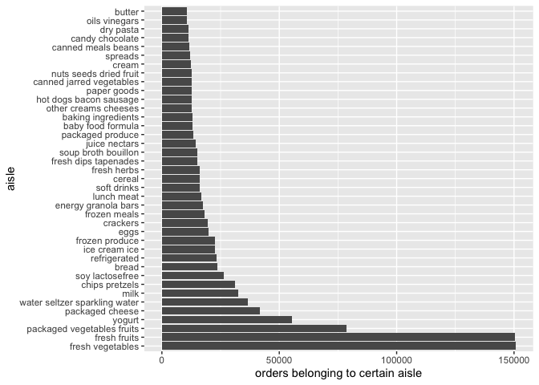

p8105_hw3_lz2951
================
lz2951
2023-10-07

# Import packages

``` r
library(p8105.datasets)
library(tidyverse)
```

    ## ── Attaching core tidyverse packages ──────────────────────── tidyverse 2.0.0 ──
    ## ✔ dplyr     1.1.3     ✔ readr     2.1.4
    ## ✔ forcats   1.0.0     ✔ stringr   1.5.0
    ## ✔ ggplot2   3.4.3     ✔ tibble    3.2.1
    ## ✔ lubridate 1.9.2     ✔ tidyr     1.3.0
    ## ✔ purrr     1.0.2     
    ## ── Conflicts ────────────────────────────────────────── tidyverse_conflicts() ──
    ## ✖ dplyr::filter() masks stats::filter()
    ## ✖ dplyr::lag()    masks stats::lag()
    ## ℹ Use the conflicted package (<http://conflicted.r-lib.org/>) to force all conflicts to become errors

# Problem 1

## Dataset description

First, import dataset.

``` r
data("instacart")
```

The dataset contains 1384617 rows and 15 columns. Each row is a product
from an order and each column is a variable. The 15 variables are:
order_id, product_id, add_to_cart_order, reordered, user_id, eval_set,
order_number, order_dow, order_hour_of_day, days_since_prior_order,
product_name, aisle_id, department_id, aisle, department. Take the
observation 1, 49302, 1, 1, 112108, train, 4, 4, 10, 9, Bulgarian
Yogurt, 120, 16, yogurt, dairy eggs as an example, it shows a Bulgarian
Yogurt with product id 49302 bought at 10 o’clock of the 4th day of the
week by a user with user id 112108. This product purchase belongs to the
order with order id 1 and order sequence order 4, in which the order of
this product to be added to the cart is 1. It has been 9 days since the
last order. The yogurt has been ordered by the user in the past, and
belongs to the aisle yogurt with aisle id 120 and department dairy eggs
with department id 16. The evaluation set this order belongs in is
train.

## Some key questions about dataset

- How many aisles are there, and which aisles are the most items ordered
  from?

``` r
instacart |>
  group_by(aisle) |>
  summarize(orders_from_aisle = n()) |>
  mutate(
    aisle_rank_by_order = min_rank(desc(orders_from_aisle))
  ) |>
  filter(aisle_rank_by_order < 2)
```

    ## # A tibble: 1 × 3
    ##   aisle            orders_from_aisle aisle_rank_by_order
    ##   <chr>                        <int>               <int>
    ## 1 fresh vegetables            150609                   1

- Make a plot that shows the number of items ordered in each aisle,
  limiting this to aisles with more than 10000 items ordered. Arrange
  aisles sensibly, and organize your plot so others can read it.

``` r
instacart |>
  group_by(aisle) |>
  summarize(orders_from_aisle = n()) |>
  filter(orders_from_aisle > 10000) |>
  ggplot(aes(x = fct_reorder(aisle, desc(orders_from_aisle)), y = orders_from_aisle)) +
  geom_col() +
  coord_flip() +
  labs(x = "aisle", y = "orders belonging to certain aisle")
```

<!-- -->

- Make a table showing the three most popular items in each of the
  aisles “baking ingredients”, “dog food care”, and “packaged vegetables
  fruits”. Include the number of times each item is ordered in your
  table.

``` r
instacart |>
  group_by(aisle, product_name) |>
  summarize(number_of_orders = n()) |>
  filter(aisle %in% c("baking ingredients", "dog food care", "packaged vegetables fruits")) |>
  mutate(
    product_rank_in_aisle = min_rank(desc(number_of_orders))
  ) |>
  filter(product_rank_in_aisle < 4) |>
  arrange(aisle, product_rank_in_aisle) |>
  knitr::kable()
```

    ## `summarise()` has grouped output by 'aisle'. You can override using the
    ## `.groups` argument.

| aisle                      | product_name                                  | number_of_orders | product_rank_in_aisle |
|:---------------------------|:----------------------------------------------|-----------------:|----------------------:|
| baking ingredients         | Light Brown Sugar                             |              499 |                     1 |
| baking ingredients         | Pure Baking Soda                              |              387 |                     2 |
| baking ingredients         | Cane Sugar                                    |              336 |                     3 |
| dog food care              | Snack Sticks Chicken & Rice Recipe Dog Treats |               30 |                     1 |
| dog food care              | Organix Chicken & Brown Rice Recipe           |               28 |                     2 |
| dog food care              | Small Dog Biscuits                            |               26 |                     3 |
| packaged vegetables fruits | Organic Baby Spinach                          |             9784 |                     1 |
| packaged vegetables fruits | Organic Raspberries                           |             5546 |                     2 |
| packaged vegetables fruits | Organic Blueberries                           |             4966 |                     3 |

- Make a table showing the mean hour of the day at which Pink Lady
  Apples and Coffee Ice Cream are ordered on each day of the week;
  format this table for human readers (i.e. produce a 2 x 7 table).

``` r
instacart |>
  filter(product_name %in% c("Pink Lady Apples", "Coffee Ice Cream")) |>
  group_by(order_dow, product_name) |>
  summarize(mean_hour_of_the_day = mean(order_hour_of_day)) |>
  pivot_wider(
    names_from = order_dow,
    values_from = mean_hour_of_the_day
  ) |>
  rename(
    mean_hour_of_Sunday = 2,
    mean_hour_of_Monday = 3,
    mean_hour_of_Tuesday = 4,
    mean_hour_of_Wednesday = 5,
    mean_hour_of_Thusday = 6,
    mean_hour_of_Friday = 7,
    mena_hour_of_Saturday = 8
  ) |>
  knitr::kable()
```

    ## `summarise()` has grouped output by 'order_dow'. You can override using the
    ## `.groups` argument.

| product_name     | mean_hour_of_Sunday | mean_hour_of_Monday | mean_hour_of_Tuesday | mean_hour_of_Wednesday | mean_hour_of_Thusday | mean_hour_of_Friday | mena_hour_of_Saturday |
|:-----------------|--------------------:|--------------------:|---------------------:|-----------------------:|---------------------:|--------------------:|----------------------:|
| Coffee Ice Cream |            13.77419 |            14.31579 |             15.38095 |               15.31818 |             15.21739 |            12.26316 |              13.83333 |
| Pink Lady Apples |            13.44118 |            11.36000 |             11.70213 |               14.25000 |             11.55172 |            12.78431 |              11.93750 |
